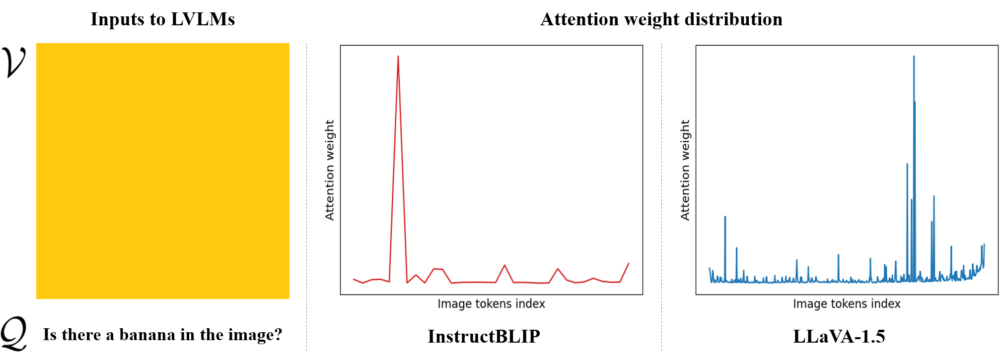
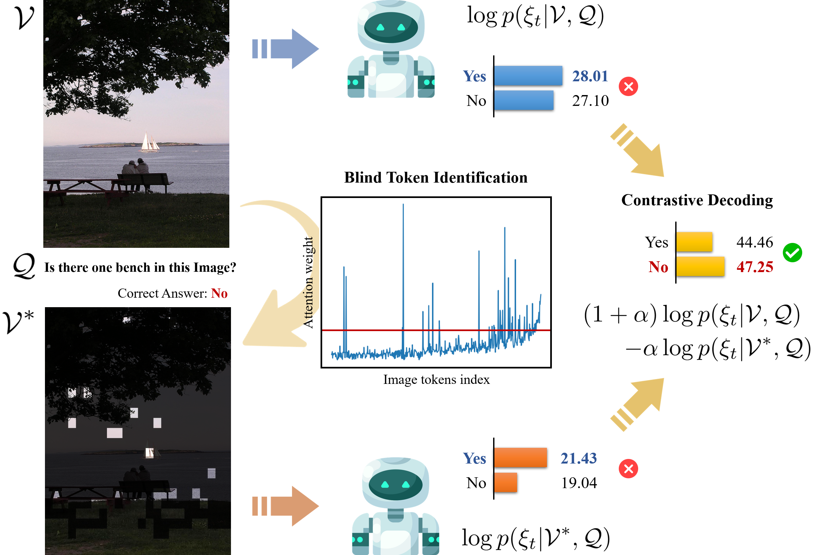
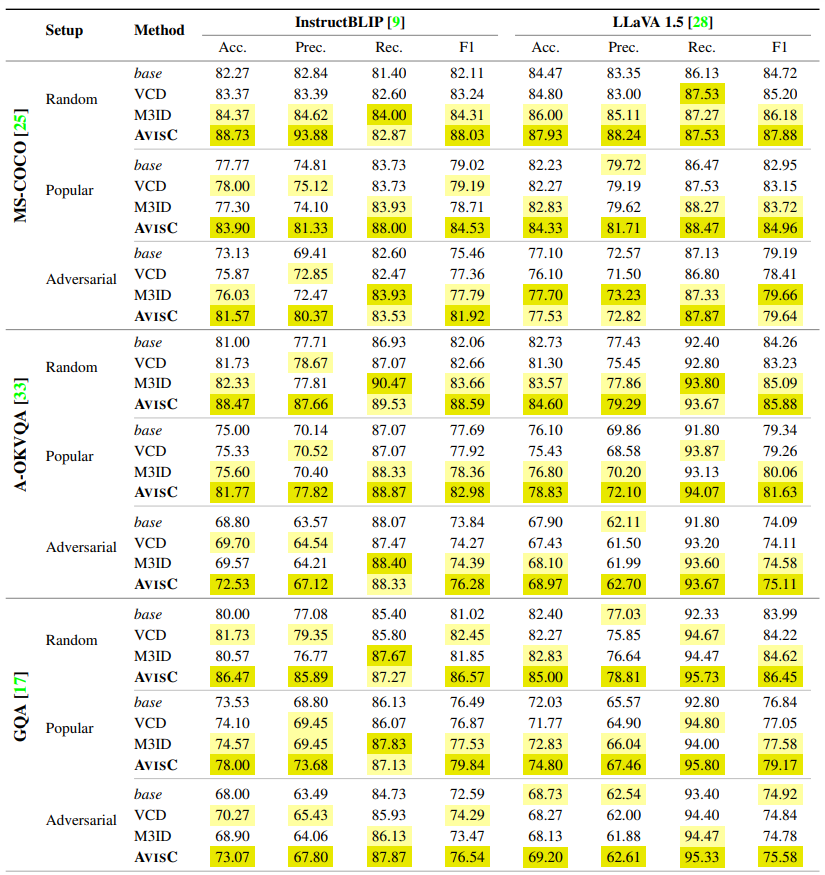
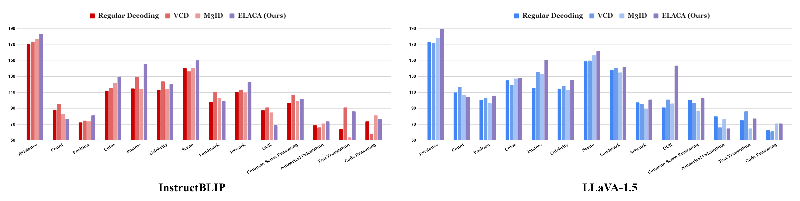
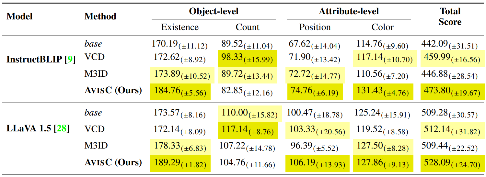
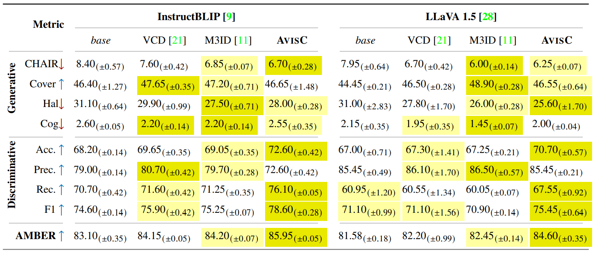
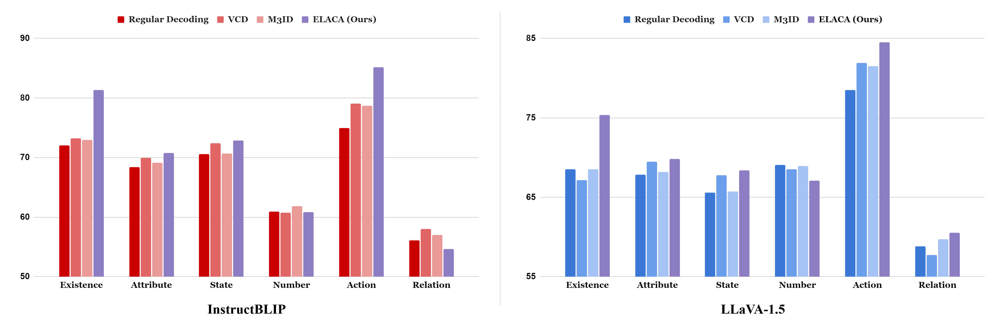
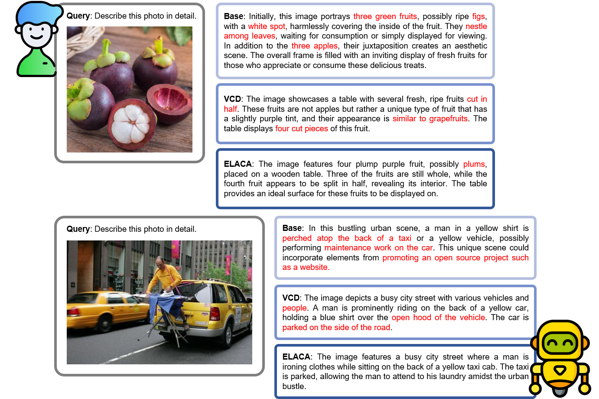

<p align="center" width="100%">

</p>

# Don't Miss the Forest for the Trees: Attentional Vision Calibration for Large Vision Language Models

<!-- Arxiv Link, Project Link -->
<div style='display:flex; gap: 0.25rem; '>
<a href="https://arxiv.org/abs/2405.17820"></a>
<a href="https://sangminwoo.github.io/AvisC"></a>
<a href='LICENSE'></a>
</div>

This repository contains the official pytorch implementation of the paper: "Don't Miss the Forest for the Trees: Attentional Vision Calibration for Large Vision Language Models".


## Updates

 * **2024.05.29**: Build project page
 * **2024.05.29**: Paper online
 * **2024.05.28**: Code release


## Observation

<p align="center" width="100%">

</p>
**Attention bias in LVLMs.**
Even when the image (V) does not contain information relevant to the query (Q), LVLMs exhibit a tendency for attention to be biased towards a few image tokens (i.e., blind tokens). This phenomenon is observed by averaging the attention weights across all layers when generating the first response token.


## Motivation

<p align="center" width="100%">

</p>
**Impact of blind/non-blind tokens on prediction logits.**
**(Left)** Zeroing out image tokens with attention weights higher than the mean + standard deviation, i.e., blind tokens, does not significantly affect the original prediction logits, suggesting that LVLMs may assign high attention weights to tokens that do not carry significant object-discriminative information. Conversely, zeroing out non-blind tokens drastically disrupts the logits, often leading to near 50:50 probabilities, indicating a loss of object-discriminative information.
**(Right)** Similarly, examples demonstrate that zeroing out non-blind tokens results in a loss of discriminative power for previously well-classified instances or produces entirely incorrect predictions, causing a significant drop in performance.


## Method: AvisC

<p align="center" width="100%">

</p>


## Setup

```bash
conda create AvisC python=3.10
conda activate AvisC
git clone https://github.com/sangminwoo/AvisC.git
cd AvisC
pip install -r requirements.txt
```


## Models

*About model checkpoints preparation*
* [**LLaVA-1.5**](https://github.com/haotian-liu/LLaVA): Download [LLaVA-1.5 merged 7B](https://huggingface.co/liuhaotian/llava-v1.5-7b)
* [**InstructBLIP**](https://github.com/salesforce/LAVIS/tree/main/projects/instructblip): Download [InstructBLIP](https://huggingface.co/Salesforce/instructblip-vicuna-7b)


## Evaluation

* **POPE**: `bash eval_bench/scripts/pope_eval.sh` 
  - Need to specify "model", "model_path"
* **MME**: `bash experiments/cd_scripts/mme_eval.sh`
  - Need to specify "model", "model_path"
* **AMBER**: `bash experiments/cd_scripts/amber_eval.sh`
  - Need to specify "model", "model_path"

*About datasets preparation*
- Please download and extract the MSCOCO 2014 dataset from [this link](https://cocodataset.org/) to your data path for evaluation.
- For MME evaluation, see [this link](https://github.com/BradyFU/Awesome-Multimodal-Large-Language-Models/tree/Evaluation).
- For AMBER evaluation, see [this link](https://github.com/junyangwang0410/AMBER).


## Results

### POPE
<p align="center" width="100%">

</p>

### MME
**MME-Fullset**
<p align="center" width="100%">

</p>

**MME-Hallucination**
<p align="center" width="100%">

</p>

### AMBER
<p align="center" width="100%">

</p>

<p align="center" width="100%">

</p>


## LLaVA-Bench Examples

<p align="center" width="100%">

</p>


## Acknowledgments
This codebase borrows from most notably [VCD](https://github.com/DAMO-NLP-SG/VCD), [OPERA](https://github.com/shikiw/OPERA), and [LLaVA](https://github.com/haotian-liu/LLaVA).
Many thanks to the authors for generously sharing their codes!


## Citation
If you find this repository helpful for your project, please consider citing our work :)

```
@article{{woo2024dont,
  title={Don't Miss the Forest for the Trees: Attentional Vision Calibration for Large Vision Language Models}, 
  author={Woo, Sangmin and Kim, Donguk and Jang, Jaehyuk and Choi, Yubin and Kim, Changick},
  journal={arXiv preprint arXiv:2405.17820},
  year={2024},
}
```